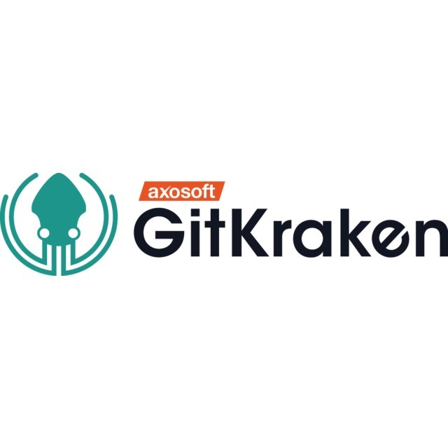

# How to Collaborate with GitHub & GitKraken

## Objective

By the end of this workshop, you will have:

*   made accounts on GitHub & GitKraken
*   forked a repo, made a branch, opened a pull request and commented on someone else's pull request
*   seen your changes merged

Our goal is to write a recipe for a chocolate cake!

## Material

### ACMBPDC

*   [Workshop](https://github.com/acmbpdc/coding-bootcamp/tree/master/sessions/04-git-workshop)

### MLH

*   [GitHub](https://docsend.com/view/udvd45h)
*   [GItKraken](https://docsend.com/view/x5num6j)

## Useful Links

### GitHub

*   [Documentation](https://guides.github.com/)
*   [Tutorial](https://guides.github.com/activities/hello-world/)

### GitKraken

*   [Documentation](https://support.gitkraken.com/)
*   GitKraken [Blog](https://blog.axosoft.com/)

## Setting up

*   Make a [GitHub](https://github.com/) account
*   Link your GitHub account with [GitKraken](https://www.gitkraken.com/invite/vpYby3kN)
*   Install [Git]((https://git-scm.com/book/en/v2/Getting-Started-Installing-Git)) and [GitKraken](https://www.gitkraken.com/download) on your local systems

## Collaborate

*   Fork this repo
*   Create a new branch on your fork
*   Submit a pull request
*   Comment on someone else's pull request
